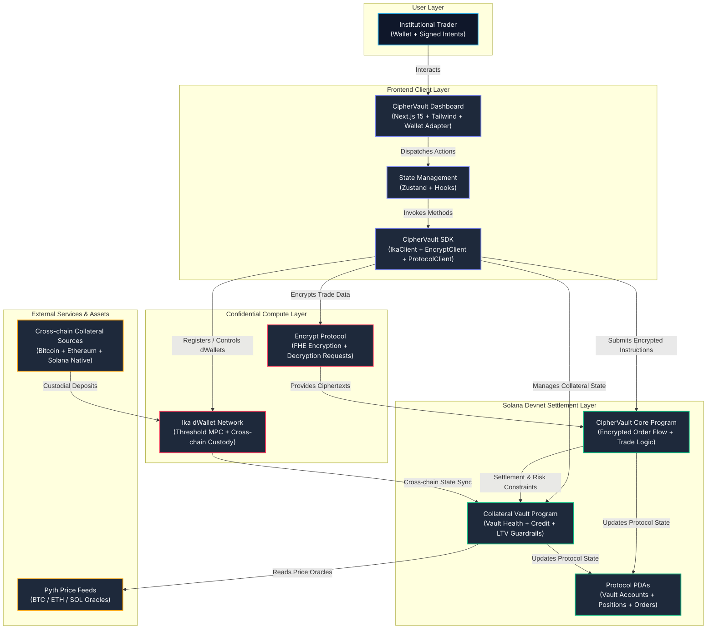

# CipherVault

Confidential institutional prime brokerage on Solana powered by **Ika dWallets** and **Encrypt FHE**.

## Live Deployment

- **Application Web Interface**: https://ciphervault-ui.vercel.app
- **Source Repository**: https://github.com/Gokul-social/CipherVault

## Deployed Smart Contracts (Solana Devnet)

- **CipherVault Core**: `8Voz2Petb9Q4xYMCqjNVXSyTzkmzMsK3cTrSVGGLF8Ug`
- **Collateral Vault**: `4jJrbTHiAP5ocWhbUqJG6m1bQ6cRkNi7vJvHWpRABwBm`

## System Architecture



## Core Project Structure

- `app/`: Next.js 15 dashboard, UI components, and trading interface.
- `sdk/`: TypeScript client libraries for integrating Ika, Encrypt, and protocol operations.
- `programs/ciphervault-core`: Anchor program for handling encrypted order flows and execution logic.
- `programs/collateral-vault`: Anchor program managing collateral deposits, vault health, and credit accounting.
- `tests/`: End-to-end integration tests validating protocol integrity.

## Local Development Setup

To run the application locally, execute the following commands in the terminal:

```bash
# Install all workspace dependencies
npm install

# Start the development server
npm run dev
```

## Available Workspace Scripts

The workspace provides several utility scripts for streamlined development:

```bash
# Build the TypeScript SDK package
npm run build:sdk

# Build the Next.js application for production
npm run build:app

# Execute Anchor smart contract test suite
npm run test:anchor

# Execute SDK integration tests
npm run test:sdk

# Configure and setup local Devnet environment
npm run setup:devnet
```
