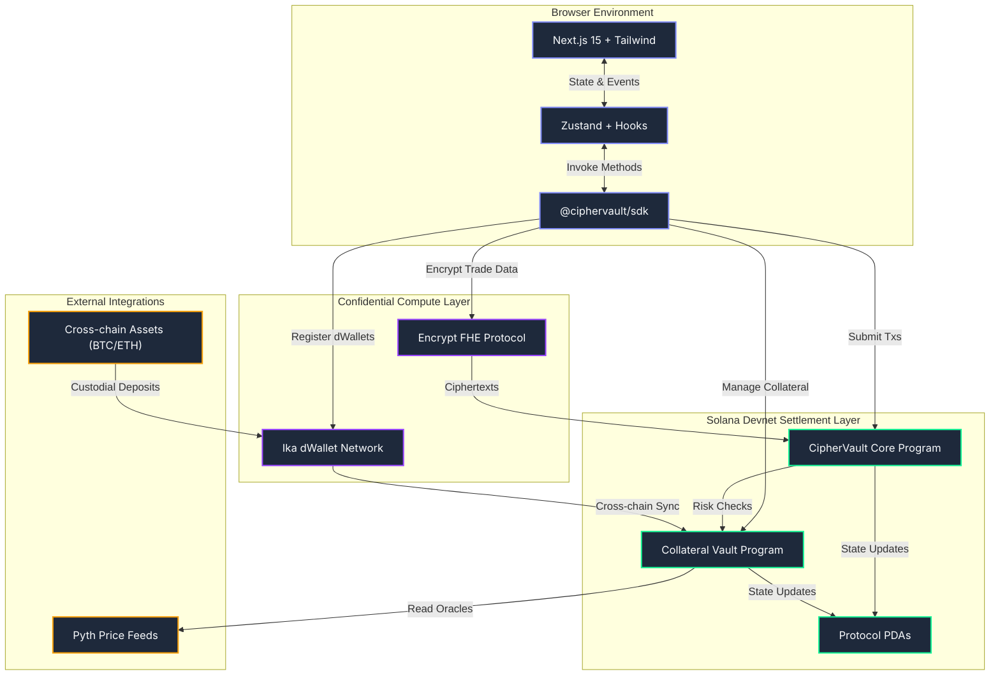

<div align="center">
  <br />
  <h1>CIPHERVAULT</h1>
  <p>
    <strong>Confidential institutional prime brokerage on Solana powered by Ika dWallets and Encrypt FHE.</strong>
  </p>
  
  <p>
    <a href="https://ciphervault-ui.vercel.app"></a>
    <a href="https://explorer.solana.com/address/8Voz2Petb9Q4xYMCqjNVXSyTzkmzMsK3cTrSVGGLF8Ug?cluster=devnet"></a>
    <a href="https://explorer.solana.com/address/4jJrbTHiAP5ocWhbUqJG6m1bQ6cRkNi7vJvHWpRABwBm?cluster=devnet"></a>
  </p>

  <p>
    
    
    
    
    
    
  </p>
  <br />
</div>

> **CIPHERVAULT** is an institutional-grade prime brokerage platform on Solana. Featuring confidential cross-chain asset custody via Ika dWallets, fully homomorphic encrypted (FHE) order flows via Encrypt, and robust on-chain settlement — this is bridgeless capital markets meets privacy-preserving DeFi.

---

## Table of Contents

- [Live Deployment](#live-deployment)
- [System Architecture](#system-architecture)
- [Protocol Features](#protocol-features)
- [Technology Stack](#technology-stack)
- [Quick Start](#quick-start)
- [Workspace Scripts](#workspace-scripts)
- [Project Structure](#project-structure)

---

## Live Deployment

| Component | URL / ID | Status |
|:---|:---|:---:|
| **Frontend Dashboard** | [ciphervault-ui.vercel.app](https://ciphervault-ui.vercel.app) | Live |
| **CipherVault Core** | [`8Voz...F8Ug`](https://explorer.solana.com/address/8Voz2Petb9Q4xYMCqjNVXSyTzkmzMsK3cTrSVGGLF8Ug?cluster=devnet) | Deployed |
| **Collateral Vault** | [`4jJr...wBm`](https://explorer.solana.com/address/4jJrbTHiAP5ocWhbUqJG6m1bQ6cRkNi7vJvHWpRABwBm?cluster=devnet) | Deployed |
| **Network** | Solana Devnet | Active |

### Contract Details

```
Core Program ID   : 8Voz2Petb9Q4xYMCqjNVXSyTzkmzMsK3cTrSVGGLF8Ug
Vault Program ID  : 4jJrbTHiAP5ocWhbUqJG6m1bQ6cRkNi7vJvHWpRABwBm
Network           : Solana Devnet
Framework         : Anchor
```

---

## System Architecture

Full-stack architecture: Next.js frontend ↔ Ika/Encrypt SDKs ↔ Solana RPC ↔ Anchor Smart Contracts.



---

## Protocol Features

| Feature | Description |
|:---|:---|
| **Confidential Trading** | Encrypts order sizes and pricing data using Fully Homomorphic Encryption (FHE) |
| **Cross-chain Custody** | Decentralized, non-custodial asset management via Ika dWallet MPC networks |
| **On-chain Settlement** | Deterministic trade execution and collateral accounting on Solana |
| **Dynamic LTV Engine** | Real-time vault health tracking powered by Pyth Network oracle price feeds |
| **Zustand Architecture** | Robust frontend state management coupled with a unified transaction engine |
| **Institutional UX** | Premium, responsive dashboard built with Next.js 15 and modern TailwindCSS |

---

## Technology Stack

| Layer | Technology | Function |
|:---|:---|:---|
| **Frontend** | Next.js 15 | React framework for dashboard UI and routing |
| **Styling** | Tailwind CSS | Utility-first CSS for institutional-grade design |
| **State** | Zustand | Global state management and transaction tracking |
| **Solana SDK** | `@solana/web3.js` | RPC interactions, Tx building, wallet adapter |
| **Confidential** | Ika & Encrypt SDKs | Threshold MPC custody and FHE payload generation |
| **Smart Contracts** | Anchor (Rust) | Solana program logic (`ciphervault-core`, `collateral-vault`) |
| **Oracles** | Pyth Network | Real-time cryptocurrency price data feeds |
| **Hosting** | Vercel | Edge-optimized deployment for the web interface |

---

## Quick Start

### Prerequisites
- [Node.js](https://nodejs.org/) v18+
- [Solana CLI](https://docs.solana.com/cli/install-solana-cli-tools) & [Anchor](https://www.anchor-lang.com/docs/installation)
- Phantom Wallet (browser extension)

### 1. Clone & Install
```bash
git clone https://github.com/Gokul-social/CipherVault.git
cd CipherVault
npm install
```

### 2. Configure Environment
```bash
# Set up Devnet configuration
solana config set --url devnet
npm run setup:devnet
```

### 3. Start Development Server
```bash
npm run dev
```

### 4. Connect & Test
1. Open `http://localhost:3000`
2. Connect your Phantom wallet (ensure it is set to **Devnet**)
3. Initialize your collateral vault and start managing cross-chain positions!

---

## Workspace Scripts

The workspace provides several utility scripts for streamlined development:

```bash
# Build the TypeScript SDK package
npm run build:sdk

# Build the Next.js application for production
npm run build:app

# Execute Anchor smart contract test suite
npm run test:anchor

# Execute SDK integration tests
npm run test:sdk
```

---

## Project Structure

```
CipherVault/
├── app/                          # Next.js Frontend Dashboard
│   ├── src/
│   │   ├── app/                  # Application routes (Pages)
│   │   ├── components/           # UI Components (Modals, Toasts)
│   │   └── store/                # Zustand global state
├── programs/
│   ├── ciphervault-core/         # Order flow & trade execution contract
│   └── collateral-vault/         # Vault health & credit accounting contract
├── sdk/                          # Unified TypeScript Client Libraries
├── scripts/                      # Deployment & setup utilities
├── tests/                        # End-to-end integration tests
├── Anchor.toml                   # Anchor workspace configuration
└── package.json                  # Workspace dependencies
```

---

<div align="center">
  <br />
  <p>Built on <strong>Solana</strong> · Secured by <strong>Ika</strong> & <strong>Encrypt</strong></p>
  <p>
    <a href="https://ciphervault-ui.vercel.app">Live App</a> · 
    <a href="https://explorer.solana.com/address/8Voz2Petb9Q4xYMCqjNVXSyTzkmzMsK3cTrSVGGLF8Ug?cluster=devnet">Core Program</a> · 
    <a href="https://explorer.solana.com/address/4jJrbTHiAP5ocWhbUqJG6m1bQ6cRkNi7vJvHWpRABwBm?cluster=devnet">Vault Program</a>
  </p>
</div>
